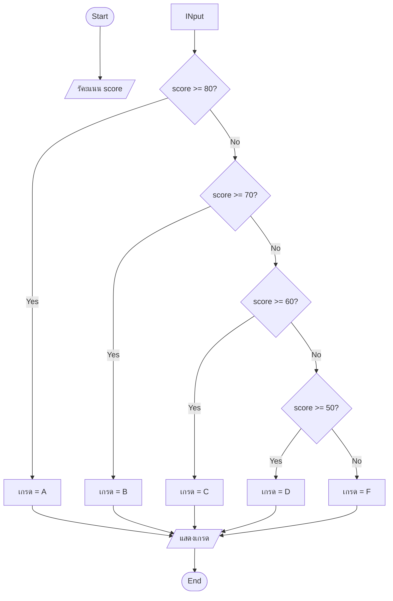
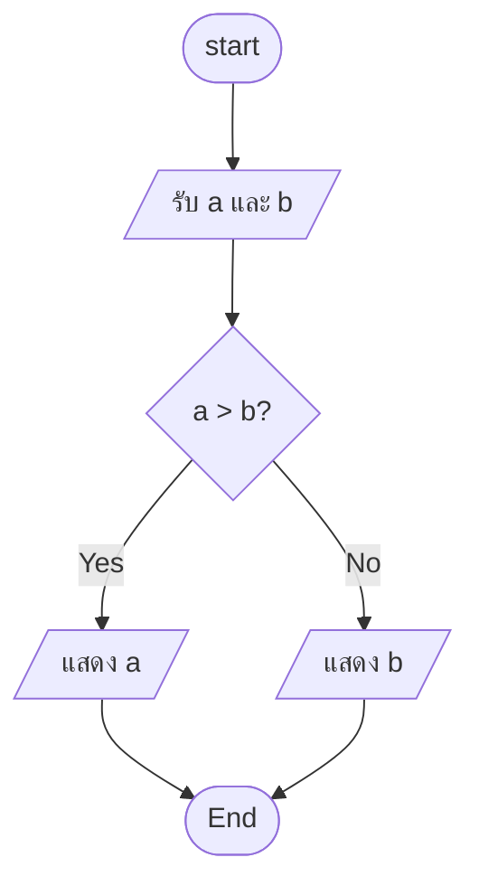
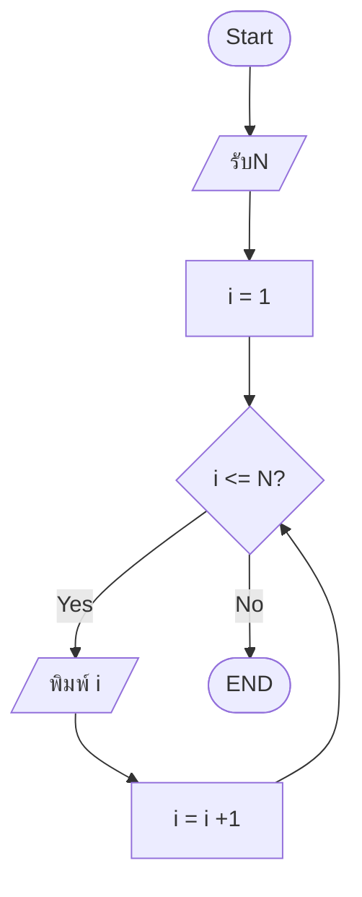

**A: ตรวจสอบเกรด0**

```mermaid
flowchart TD
	Strat([Start]) --> Input[/รัคะแนน score/]
	INput --> D1{score >= 80?}
	D1 --> |Yes| A[เกรด = A]
	D1 --> |No| D2{score >= 70?}
	D2 --> |Yes| B[เกรด = B]
	D2 --> |No| D3{score >= 60?}
	D3 --> |Yes| C[เกรด = C]
	D3 --> |No| D4{score >= 50?}
	D4 --> |Yes| D[เกรด = D]
	D4 --> |No| F[เกรด = F]
	A & B & C & D & F --> Output[/แสดงเกรด/]
	Output --> End([End])
```

**B:หาค่าสูงสุดจาก 2 ตัวเลข**

```mermaid
flowchart TD
     	Start([start]) -->I[/รับ a และ b/]  
	I --> D{a > b?}
	D -->|Yes| a[/แสดง a/]
	D -->|No| b[/แสดง b/]
	a & b -->  End([End])
```

**C:นับจาก 1 ถึง N**

```mermaid
flowchart TD
	Start([Start]) --> I[/รับN/]
	I --> p[i = 1]
	p --> d{i <= N?}
	d -->|Yes| i[/พิมพ์ i/]
	i -->p2[i = i +1] -->
	d -->|No| End([END])
```
