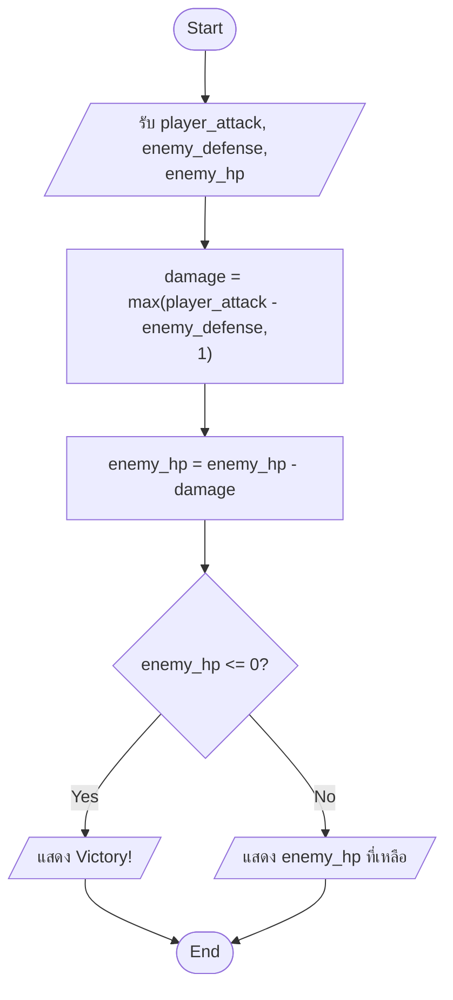

**EX:**

BEGIN [ชื่อ algorithm]
 	INPUT ...
 	IF ... THEN
	     ...
	 ELSE
	     ...
 	END IF
	OUTPUT ...
	END

**A : ระบบ Combat
ตัวอย่าง Mermaid ที่สมบูรณ์:**

```mermaid
flowchart TD
 Start([Start]) --> Input[/รับ player_attack, enemy_defense,
enemy_hp/]
 Input --> Calc["damage = max(player_attack - enemy_defense,
1)"]
 Calc --> Reduce["enemy_hp = enemy_hp - damage"]
 Reduce --> D1{enemy_hp <= 0?}
 D1 -->|Yes| Win[/แสดง Victory!/]
 D1 -->|No| Show[/แสดง enemy_hp ที่เหลือ/]
 Win & Show --> End([End])
```
