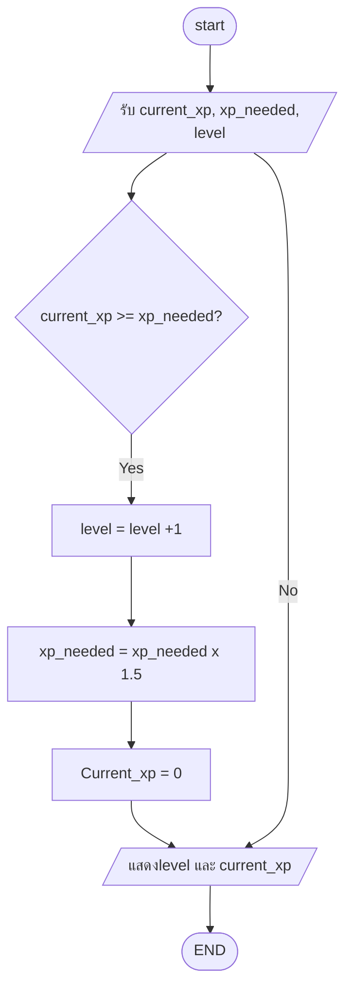

**B:ระบบ Level Up**

```mermaid
flowchart TD
	Start([start]) --> I[/รับ current_xp, xp_needed,
level/]
	I --> D{ current_xp >= xp_needed?}

	D -->|Yes| level[level = level +1]
	level --> l1[xp_needed = xp_needed x 1.5]
	l1 --> C[Current_xp = 0]
	C --> l[/แสดงlevel และ current_xp/]
	l -->End([END])
	I -->|No|l[/แสดงlevel และ current_xp/]


```
