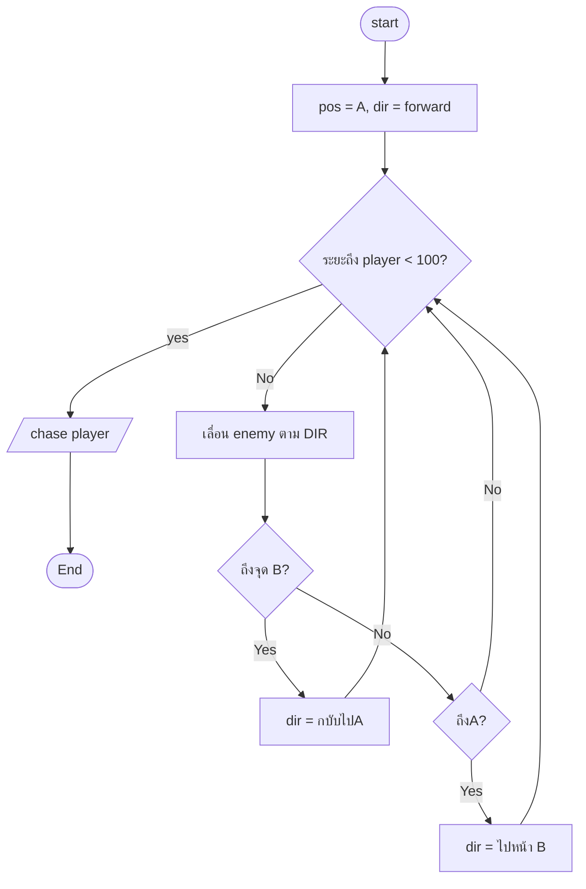

**B:ระบบ Level Up**

```mermaid
flowchart TD
	Start([start]) --> I[/รับ current_xp, xp_needed,
level/]
	I --> D{ current_xp >= xp_needed?}

	D -->|Yes| level[level = level +1]
	level --> l1[xp_needed = xp_needed x 1.5]
	l1 --> C[Current_xp = 0]
	C --> l[/แสดงlevel และ current_xp/]
	l -->End([END])
	I -->|No|l[/แสดงlevel และ current_xp/]


```

**C:Simple AI Patrol**

```mermaid
flowchart TD
	Start([start]) --> Input[pos = A, dir = forward]
	Input --> DIR{ระยะถึง player < 100?}
	DIR --> |yes| I[/chase player/]-->E([End])
	DIR -->|No| Eny[เลื่อน enemy ตาม DIR]-->Loc{ถึงจุด B?}
	Loc -->|Yes| DIR1[dir = กบับไปA] -->DIR
	Loc -->|No|Loc1{ถึงA?}
	Loc1 -->|Yes| Dir2[dir = ไปหน้า B] -->DIR
	Loc1 -->|No| DIR
```
